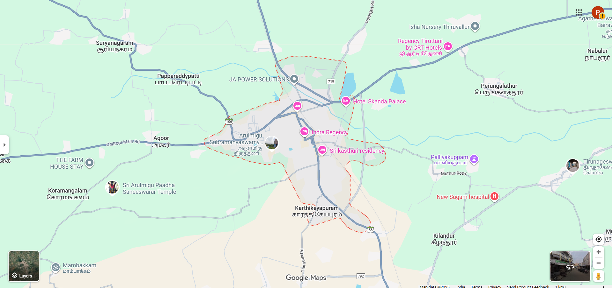
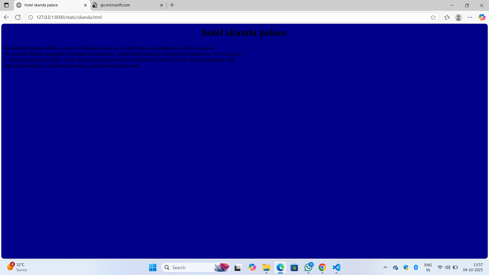
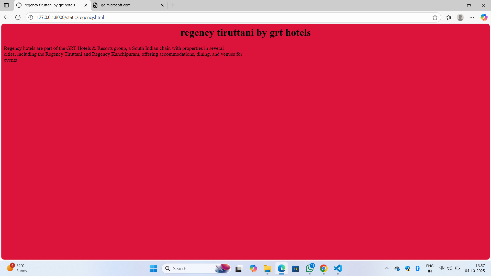
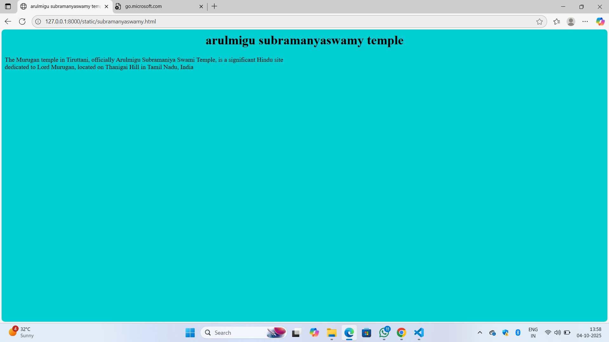
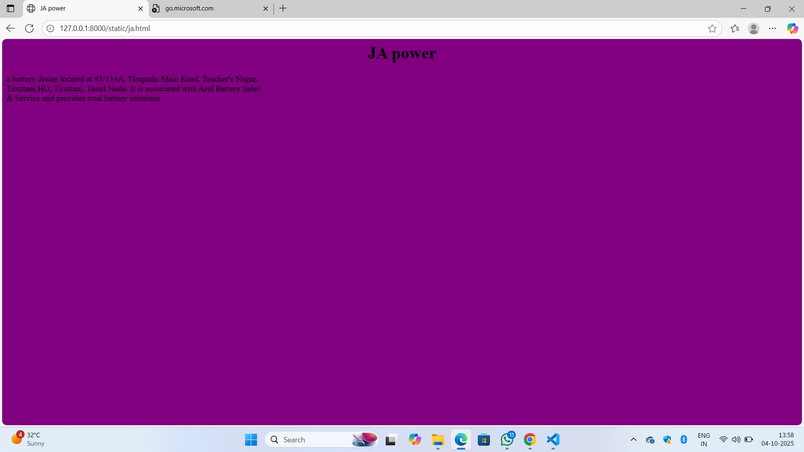
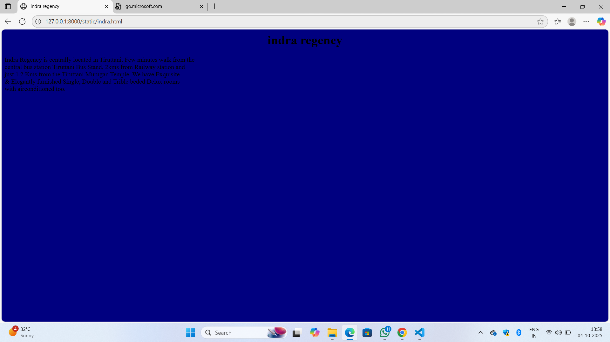

# Ex04 Places Around Me
## Date: 19-09-20025

## AIM
To develop a website to display details about the places around my house.

## DESIGN STEPS

### STEP 1
Create a Django admin interface.

### STEP 2
Download your city map from Google.

### STEP 3
Using ```<map>``` tag name the map.

### STEP 4
Create clickable regions in the image using ```<area>``` tag.

### STEP 5
Write HTML programs for all the regions identified.

### STEP 6
Execute the programs and publish them.

## CODE
```
map.html
<html>
    <head>
        <tittle></tittle>
        <link rel ="stylesheet" href="style.css">
    </head>
    <body>
        <h1 align="center">
            <font color="blue"><b>tiruttani</b>
            </font>
        </h1>
        <h3 align="center">
            <font color="orange"><b>LAKSHMI PRANAY N (25017706)</b></font>
        </h3>
        <center>




<map name="image-map">
    <area target="" alt="skanda" title="skanda" href="" coords="1048,291,1133,332" shape="rect">
    <area target="" alt="regency" title="regency" href="" coords="1402,156,37" shape="circle">
    <area target="" alt="ja power" title="ja power" href="" coords="904,220,882,254,913,278,947,251,932,217" shape="poly">
    <area target="" alt="subramanyaswamy" title="subramanyaswamy" href="" coords="894,474,811,438" shape="rect">
    <area target="" alt="indra" title="indra" href="" coords="957,407,24" shape="circle">
</map>
</center>
     </body>
</html>

skanda.html
<html>
    <head>
        <title>hotel skanda palace</title>
        
        <style>
        body{
            background-color:darkblue;
        }
        h1{
            text-align: center;
        }
        </style>


    </head>
<body>
    <h1>hotel skanda palace</h1>
    <p>
        Our hotel restaurant offers a variety of dining options to suit the tastes and preferences of all our guests.<br>
        Our Luxury Rooms equipped with high-end amenities, comfortable bedding, and spacious bathrooms. You can enjoy<br>
        a relaxing and peaceful stay, which are designed to provide a comfortable StayOur Luxury Rooms equipped with<br>
         high-end amenities, comfortable bedding, and spacious bathrooms<br>
    </p>
</body>


</html>

regency.html
<html>

<head>
    <title>regency tiruttani by grt hotels</title>

    <style>
        body {
            background-color: crimson;
        }

        h1 {
            text-align: center;
        }
    </style>


</head>

<body>
    <h1>regency tiruttani by grt hotels</h1>
    <p>
        Regency hotels are part of the GRT Hotels & Resorts group, a South Indian chain with properties in several<br>
        cities, including the Regency Tiruttani and Regency Kanchipuram, offering accommodations, dining, and venues for<br>
        events<br>

    </p>
</body>

</html>

subramanyaswamy.html
<html>

<head>
    <title>arulmigu subramanyaswamy temple</title>

    <style>
        body {
            background-color: darkturquoise;
        }

        h1 {
            text-align: center;
        }
    </style>
</head>

<body>
    <h1>arulmigu subramanyaswamy temple</h1>
    <p>
        The Murugan temple in Tiruttani, officially Arulmigu Subramaniya Swami Temple, is a significant Hindu site<br>
        dedicated to Lord Murugan, located on Thanigai Hill in Tamil Nadu, India<br>
    </p>


</body>


</html>

ja.html
<html>

<head>
    <title>JA power</title>

    <style>
        body {
            background-color: purple;
        }

        h1 {
            text-align: center;
        }
    </style>
</head>

<body>
    <h1>JA power</h1>
    <p>
       a battery dealer located at #3/134A, Tirupathi Main Road, Teacher's Nagar,<br>
        Tiruttani HO, Tiruttani, Tamil Nadu. It is associated with Arul Battery Sales<br> 
        & Service and provides total battery solutions.<br>
    </p>


</body>


</html>

indra.html
<html>

<head>
    <title>indra regency</title>

    <style>
        body {
            background-color: navy;
        }

        h1 {
            text-align: center;
        }
    </style>
</head>

<body>
    <h1>indra regency</h1>
    <p>
      Indra Regency is centrally located in Tiruttani. Few minutes walk from the<br>
       central bus station Tiruttani Bus Stand, 2kms from Railway station and<br>
        just 1.2 Kms from the Tiruttani Murugan Temple. We have Exquisite<br>
         & Elegantly furnished Single, Double and Trible beded Delux rooms<br>
          with airconditioned too.<br>
    </p>


</body>


</html>

```
## OUTPUT








## RESULT
The program for implementing image maps using HTML is executed successfully.
